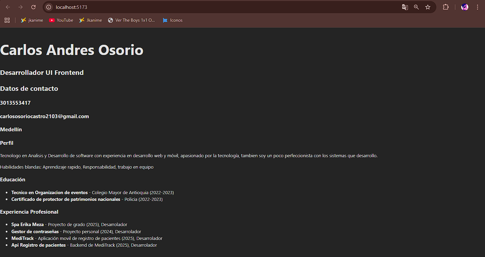

CV React Carlos Osorio

Para ejecutar el proyecto primero debemos clonar el repositorio e instalar las dependencias necesarias, luego se ejecuta con npm run dev y por ultimo abrimos el puerto en el navegador.